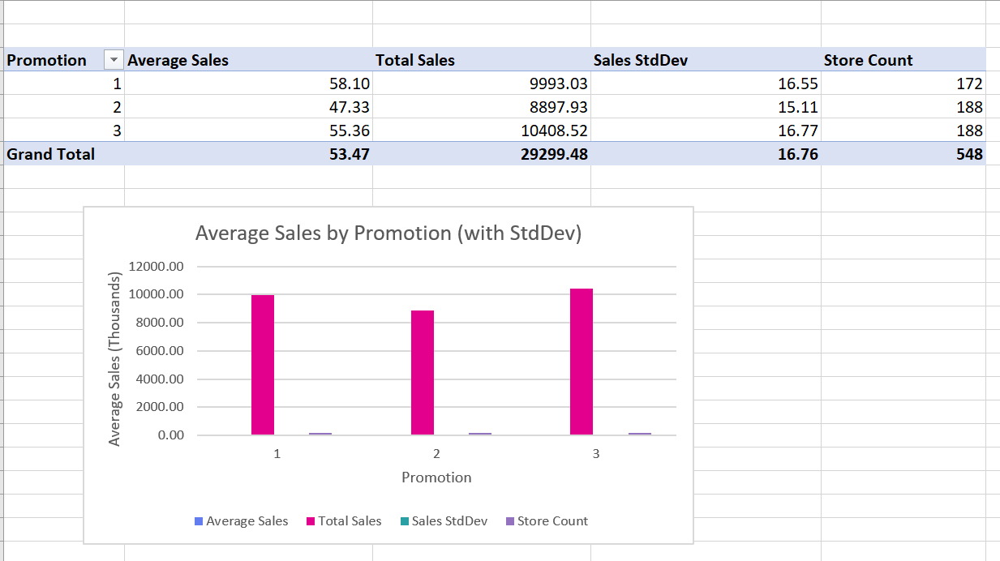
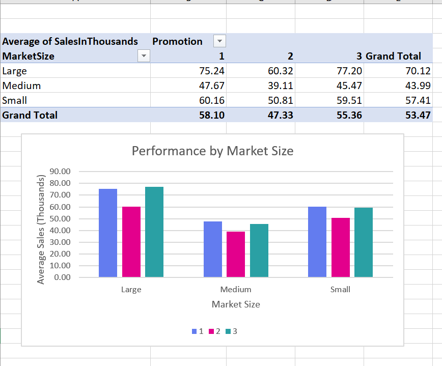

# Marketing Campaign Analysis

**Overview**  
This project analyzes a retail marketing campaign dataset using **SQL (via SQLite in Python)** and **Excel pivot tables/charts**. It highlights promotion performance, market size impact, weekly sales trends, and store age effects.

---

## Dataset
- File: `data/marketing_campaigns.csv`  
- Rows: 548  
- Columns: MarketID, LocationID, Promotion, SalesInThousands, MarketSize, AgeOfStore, Week

---

## Analysis Highlights

### 1. Promotion Performance
- Average sales highest for **Promotion A**.  
- Promotion C performs moderately, and Promotion B lowest.  



---

### 2. Weekly Sales Trends
- Promotions show consistent trends across weeks.  
- Promotion A maintains momentum, indicating strong sustainability.  


---

### 3. Market Size Impact
- Large markets have highest average sales.  
- Small markets show more variability.  



---

## How to Run SQL Analysis
1. Open terminal and navigate to repo.  
2. Run Python script:
```bash
python sql_analysis/analysis.py
